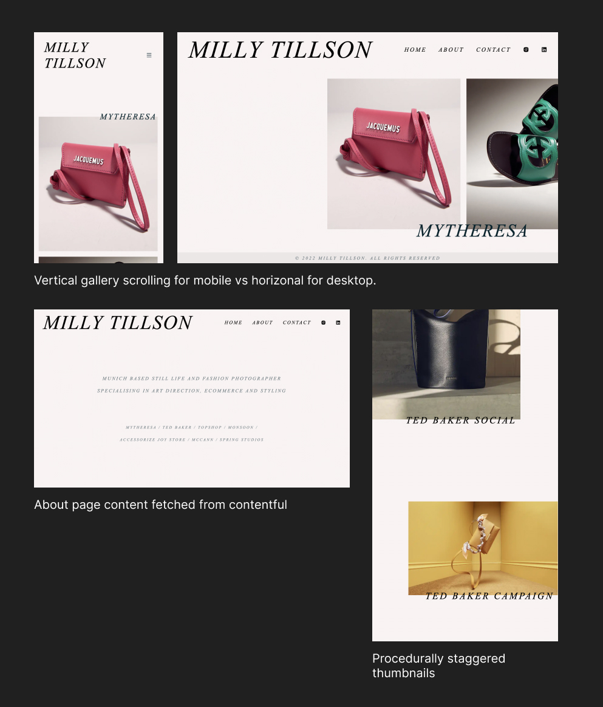

# Milly Tillson - Photographer portfolio site

A simple Website that showcases the work of Munich-based photographer Milly Tillson, and allows her to update content easily.

## Table of contents

- [Overview](#overview)
  - [About](#about)
  - [Screenshot](#screenshot)
  - [Links](#links)
- [My process](#my-process)
  - [Built with](#built-with)
  - [What I learned](#what-i-learned)
  - [Continued development](#continued-development)
  - [Useful resources](#useful-resources)
- [Author](#author)

## Overview

### About

- The site is fully responsive. The layout changes to provide the user with the best user experience, whatever device they are using.

- Features a home page with procedurally staggered and animated thumbnails, which will be applied to any future gallery the client chooses to add. 

- Each gallery page automatically resizes its images so they fit together in a scrollable carousel and line up neatly. And the Next.js Image component is used to ensure good image optimisation and lazy loading.

- Gallery images and about section content is all fetched using GraphQL from Contentful CMS. I chose Contentful as I think it offers the best experience for my client updating her website down the road.

### Screenshot

### Links

- [Live site](https://milly-tillson-website.vercel.app/)

## My process

### Built with

- Next.js
- Styled Components
- Contentful CMS
- GraphQL
- Vercel
- TypeScript

### What I learned

This Project was a chance for me to put into action what I had been learning about styled-components. I find them really intuitive and think that styled components are now my favourite method of styling. They might not be as immediate as Tailwind, but I like how clean they are and I think the trade-offs in terms of readability and organisation are worth it.

This site was my first time using Contentful CMS and found it very easy to implement, especially compared with Strapi CMS. It also allowed me to use GraphQL to query the content. I have used GraphQL before but this was a great opportunity to get even more comfortable writing queries in this way. Contentful’s GraphQL playground was very helpful in testing the queries before adding them to my code. 

Building a site professionally for a real client was also a new experience and a massive learning curve. There is added pressure when someone is paying you for your development work but was really rewarding. The experience also brought home the importance of comunication when there are other stakeholders involved in your work. I am excited to see what challenges my next professional project brings.

I decided to try and implement TypeScript on this project and had varying levels of success. I definitely need to continue learning about how to use typescript but this was a good introduction and know what I need to work on the next time I try to use it.

### Continued development

Conversations with my client have indicated that she would like to add some further features down the road. A custom cursor, contact form etc. So it is possible that in the new year these new features will be added. I will update this document when this occurs.

My client is currently in the process of purchasing a domain name for this site, so when that is completed I will add it to this site. She is also looking at designing a favicon to replace the default one provided by Next.js and I will be more than happy to add that when the time comes too.

### Useful resources

- [Next.js Image Component](https://nextjs.org/docs/api-reference/next/image) - There are a couple of gotchas’s when working with Next.js image components when the src is external. The Next.js docs section on remote patterns helped me overcome this small roadblock.
- [Styled Components Crash Course & Project - Traversy Media](https://www.youtube.com/watch?v=02zO0hZmwnw&t=673s) - Traversy Media's youtube channel has so many top quality free crash courses in development, and this one on styled-components is exceptionally good. 
- [Contentful Docs](contentful.com/developers/docs/) - Contentful has really great documentation that guided me through the process of setting up the CMS and linking it to my project. I would definitely recommend Contentful to anyone looking for a headless CMS.

## Author

Jacob Dunbar
[jacobdunbar.com](https://www.jacobdunbar.com)
